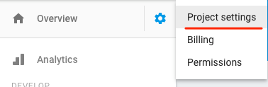
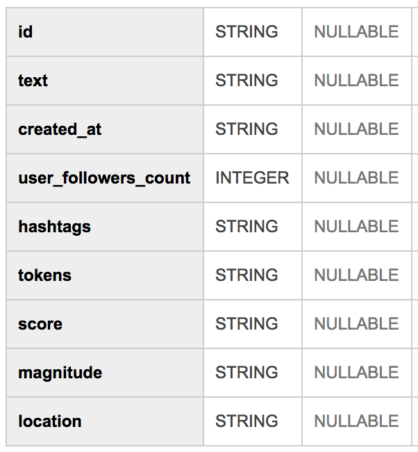

*This is not an official Google product*

# ML API next talk demos

This repo includes 4 demos from my [Google Next talk](https://youtu.be/w1xNTLH1zlA) and [Google I/O talk](https://www.youtube.com/watch?v=ETeeSYMGZn0) on the Cloud ML APIs. To run the demos, follow the instructions below.

## Vision API + Firebase demo

1. `cd` into `vision-api-firebase`
2. Create a project in the [Firebase console](http://firebase.google.com/console) and install the [Firebase CLI](https://firebase.google.com/docs/cli/)
3. Run `firebase login` via the CLI and then `firebase init functions` to initialize the Firebase SDK for Cloud Functions. When prompted, don't overwrite `functions/package.json` or `functions/index.js`.
4. In your Cloud console for the same project, enable the Vision API
5. Generate a service account for your project by navigating to the "Project settings" tab in your Firebase console and then selecting "Service Accouts". Click "Generate New Private Key" and save the file to your `functions/` directory in a file called `keyfile.json`:




6. In `functions/index.js` replace both instances of `your-firebase-project-id` with the ID of your Firebase project
7. Deploy your Cloud Function by running `firebase deploy --only functions`
8. From the Authentication tab in your Firebase console, enable *Twitter authentication* (you can use whichever auth provider you'd like, I chose Twitter).
9. Run the frontend locally by running `firebase serve` from the `vision-api-firebase/` directory of this project. Navigate to `localhost:5000` to try uploading a photo. After uploading a photo check your Functions logs and then your Firebase Database to confirm the function executed correctly.
10. Deploy the frontend by running `firebase deploy --only hosting`. For future deploys you can run `firebase deploy` to deploy Functions and Hosting simultaneously.

## Speech API Bash demo

1. `cd` into `speech/`
2. Make sure you have [SoX](http://sox.sourceforge.net/) installed. On a Mac: `brew install sox --with-flac`
3. Create a project in the Cloud console and generate a new API key. Add your API key in `request.sh`
3. Run the script: `bash request.sh`

## Natural Language API BigQuery demo

1. `cd` into `natural-language/`
2. Generate [Twitter Streaming API](https://dev.twitter.com/streaming/overview) credentials and copy them to `local.json`
3. Create a Google Cloud project, generate a JSON keyfile, and add the filepath to `local.json`
4. Create a BigQuery dataset and table with the below schema, add them to `local.json`


5. Generate an API key and add it to `local.json`
6. Change line 37 to filter tweets on whichver terms you'd like
7. Install node modules: `npm install`
8. Run the script: `node twitter.js`

## Natural Language API + Firebase realtime Twitter dashboard demo

1. `cd` into `nl-firebase-twitter/`
2. Create a project in the [Firebase console](http://firebase.google.com/console) and install the [Firebase CLI](https://firebase.google.com/docs/cli/)
3. `cd` into the `frontend/` directory and run `firebase login` and `firebase init` to associate this with the Firebase project you just created. When prompted, don't overwrite existing files. Create a **database** and **hosting** project (no Functions).
4. In your Firebase console, click "Add Firebase to your web app". Copy the credentials to the top of the main.js file
5. `cd` into the `backend/` directory and run `npm install` to install dependencies
6. Generate a service account for your project by navigating to the "Project settings" tab in your Firebase console and then selecting "Service Accouts". Click "Generate New Private Key" and save this in your `backend/` directory as `keyfile.json`
7. Generate [Twitter Streaming API](https://dev.twitter.com/streaming/overview) credentials and copy them to `backend/local.json`
8. Navigate to the Cloud console for our project. Enabled the Natural Language API and generate an API key. Replace `YOUR-API-KEY` in `backend/local.json` with this key.
9. Replace `searchTerms` in `backend/index.js` with the search terms you'd like to filter tweets on
10. Replace `FIREBASE-PROJECT-ID` in `backend/local.json` with the id of your Firebase project
11. Set up BigQuery: in your Cloud console for the same project, create a BigQuery dataset. Then create a table in that dataset. When creating the table, click **Edit as text** and paste the following:
```
id:STRING,text:STRING,user:STRING,user_time_zone:STRING,user_followers_count:INTEGER,hashtags:STRING,tokens:STRING,score:STRING,magnitude:STRING,entities:STRING
```
12. Add your BigQuery dataset and table names to `backend/local.json`.
11. Run the server: from the `backend/` directory run `node index.js`. You should see tweet data being written to your Firebase database
12. In a separate terminal process, run the frontend: from the `frontend/` directory run `firebase serve`
13. Deploy your frontend: from the `frontend/` directory run `firebase deploy`


## Multiple API demo

1. `cd` into `vision-speech-nl-translate`
2. Make sure you've set up your [GOOGLE_APPLICATION_CREDENTIALS](https://developers.google.com/identity/protocols/application-default-credentials) with a Cloud project that has the Vision, Speech, NL, and Translation APIs enabled
3. Run the script: `python textify.py`
4. Note: if you're running it with image OCR, copy an image file to your local directory
